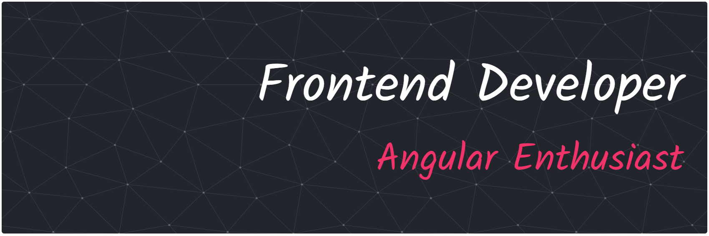

  

### 🛠️ My Tech Stack

Here are the main tools and technologies I work with.

  
  
  
  
  
  
  
  
  
  

  
  
  
  

---

### 👨‍💻 About Me

* 🚀 Software Engineer with over 4 years of experience as frontend developer, focusing on web application architecture and performance.
* 🅰️ **Angular Expert:** My primary framework. I love working with this framework becasue of its robust and opinionated structure and way of working. In addition to experimenting and implementing the new reactivity model with signals and zoneless in my projects, RxJS, and advanced state management.
* ⚛️ **Exploring new horizons:** I also enjoy building with **React** and experimenting with the speed of **Astro**.
* 💡 Always learning and seeking out best practices for writing clean, maintainable, and testable code.

---

### 📫 Let's Connect!

I'm always open to chatting about new projects, opportunities, or just tech in general!

  

